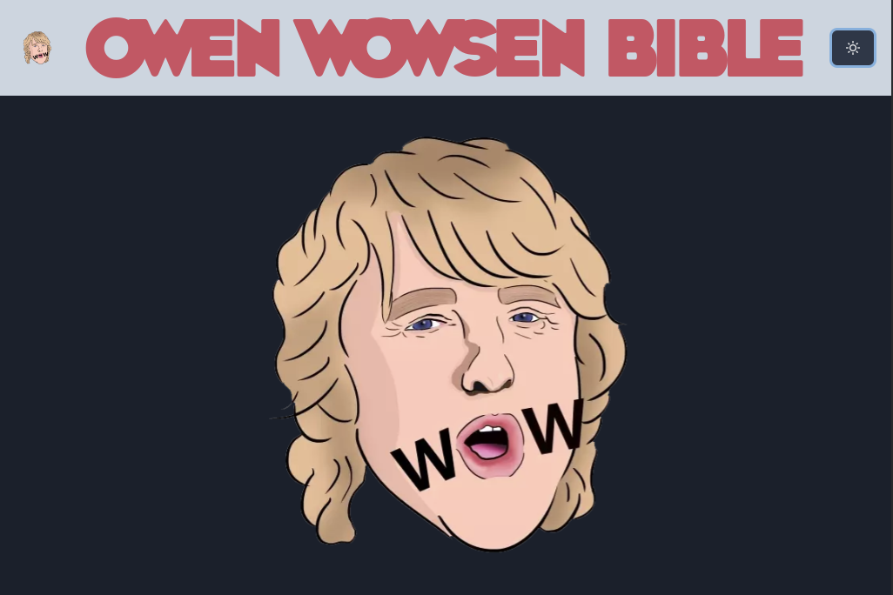
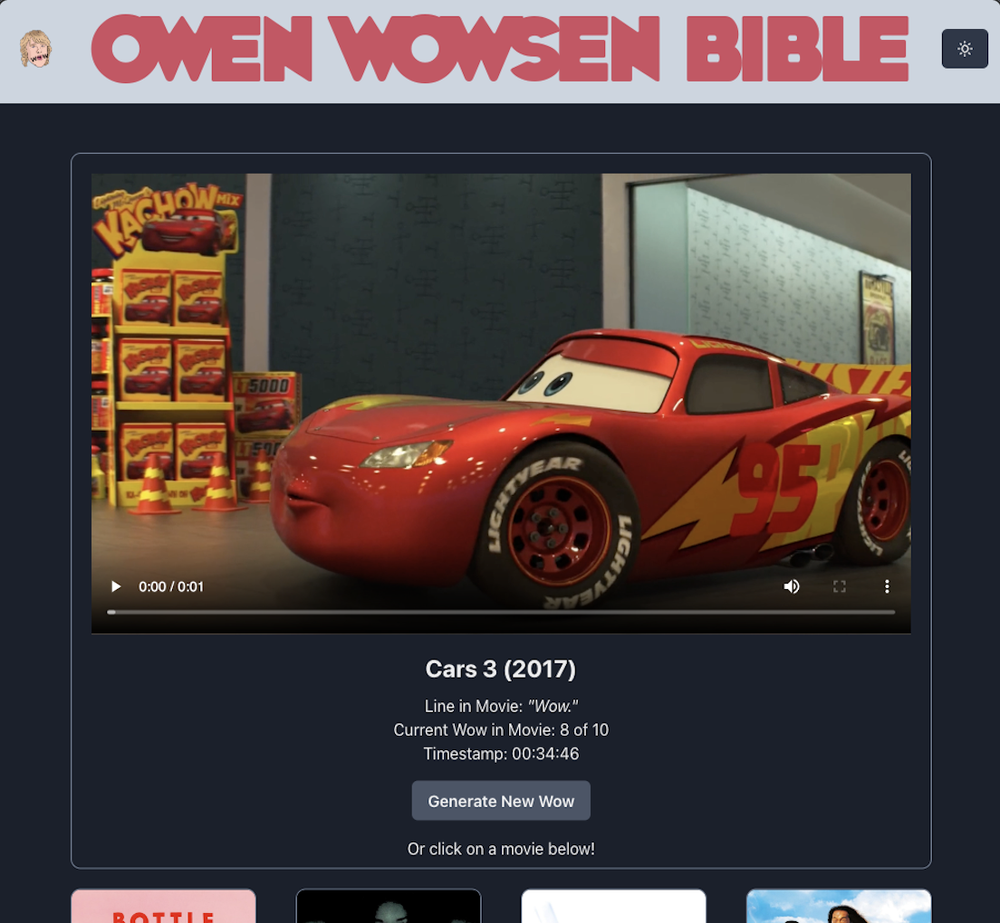
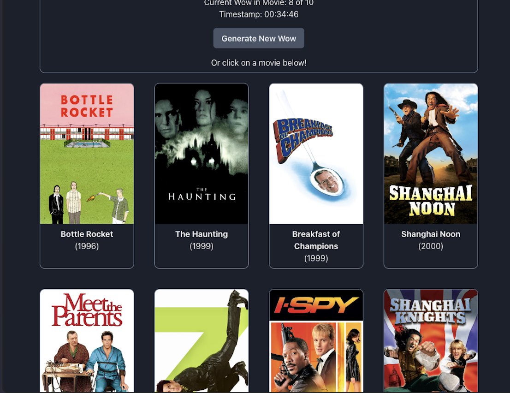
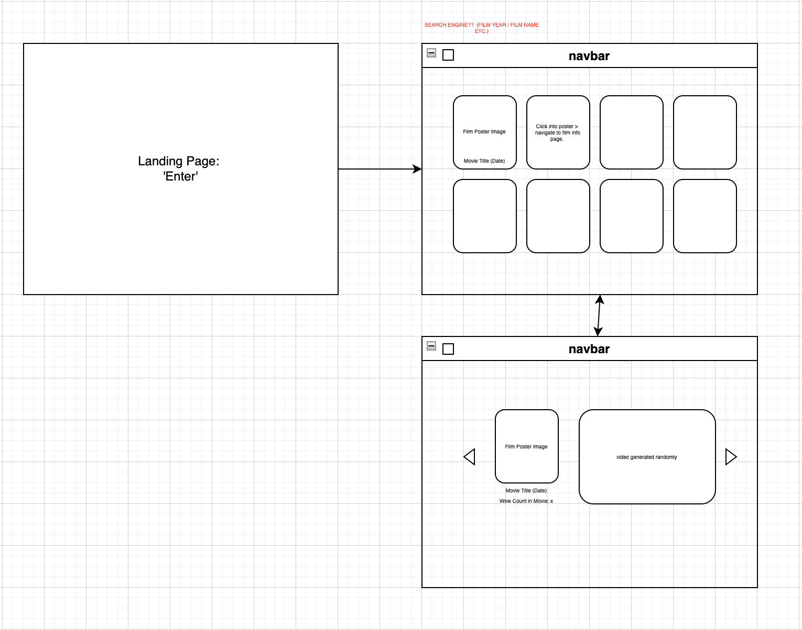

# GA Project 2: "Owen Wowsen Bible"


## Overview
The second project for the General Assembly Software Engineering Immersive course was a 28-36 hour pair programming Hackathon. I was paired with my peer Rob, AKA [greezyBob](https://github.com/greezyBob), to collaborate on a plan, wireframe and complete our first app in a pair. 

We found a public API online which highlights the number of “Wow’s” mentioned by Owen Wilson (the actor) in twelve of his featured films. 


To explore this project, you can find the deployed app via Netlify [here](https://the-great-greezybob-site.netlify.app/).


## Navigation

* [The App](#the-app)
* [Brief](#brief)
* [Technologies Used](#technologies-used)
* [General Approach](#general-approach)
  * [Planning](#planning)
  * [Wireframing](#wireframing)
* [Build Approach](#build-approach)
  * [Coding](#coding)
  * [Using the State Hook](#using-the-state-hook)
  * [Using the Effect Hook](#using-the-effect-hook)
  * [Styling](#styling)
* [Demo](#demo)
* [Challenges](#challenges)
* [Wins](#wins)
* [Key Learnings](#key-learnings)
* [Future Improvements](#future-improvements)
* [Credits](#credits)

## The App

| Homepage                 |  Mainpage                         |     Mainpage                      |
|:-------------------------:|:-------------------------:|:-------------------------:|
|   |   |   |

[Demo](#demo)


## The Brief
* Complete your first "Reacathon" (AKA a 2-day hackathon). 
* Consume a public API. 
* Use React to build the application with several components. 
* Plan your project with a wireframe. 
* Time: < 36 hours. 

## Technologies Used
 * JavaScript (ES6+)
 * HTML5/CSS3
 * React.js
 * Chakra UI
 * Open API - [The Owen Wilson WoW API](https://owen-wilson-wow-api.herokuapp.com/)
 * Axios
 * Visual Studio Code & ESlint
 * Git & GitHub
 * Insomnia

Installation Instructions for dependencies: [Package Manager](https://github.com/kobbob/SEI-Project-Two/blob/main/package.json) 

## General Approach

### Planning
Whilst exploring public API’s online, we came up with a number of suitable suggestions to pitch to one another, whilst utilising Insomnia to dig down into the data and see if the API could be used appropriately in the time frame. We also had to be conscious of any APIs with a strict rate limit for requests. 

During this planning process, I also began saving inspiration imagery for styling certain elements and developing an overarching theme. Due to the allocated time however, we decided to keep it simple and clean, opting for the CSS framework ‘Chakra UI’ which enabled us to make use of prebuilt components.

### Wireframing
In our initial wireframe, we had a number of pages the user could explore through. We quickly found that the app didn’t need this depth of navigation, and it became more effective to keep the content on one page. 




## Build Approach

### Coding
We decided to create a repo on one account and fork down on the other. We worked through the code and challenges together via Zoom and we found this method allowed us to work more efficiently in the time given. 

To make requests to the public API we used axios and assigned the chosen data to variables using the React useState and setState hooks. The API used was fairly manageable to digest, with 0-29 objects within one array. There were twelve films within this array and each instance of ‘wow’ mentioned accounted for one object (and therefore certain films accounting for more than one ‘wow’).

### Using the State Hook
Here we imported the useState Hook to call inside a function component and add some local state (from our public API) to it. 

The ‘randWow’ state is set to retrieve random ‘wow’s’ (objects) from the API. This was set with an objective of false to check whether the wow is random or not. We used this function within a function by linking an onClick function to our requested data. As we wanted to access specific movie ‘wow videos’ when the user clicked on a movie poster, we had to retrieve a random wow (object) but that also linked to the specific movie title. In addition, we added a feature to the bottom of this function where on the onClick, the browser is told to scroll to the top of the webpage where the video display port is featured in order to showcase the result. 

```javascript 
const [randWow, setRandWow] = useState(false)

 const handleMovieClick = (item) => {
   const getRandWowFromMovie = async (item) => {
     try {
       const { data } = await axios.get(`https://owen-wilson-wow-api.herokuapp.com/wows/random?movie=${item}`)
       setRandWow(data)
     } catch (error) {
       console.log(error)
     }
   }
   getRandWowFromMovie(item)
   document.body.scrollTop = 0; // For Safari
   document.documentElement.scrollTop = 0; // For Chrome, Firefox, IE and Opera
 }

 const handleClick = () => {
   getRandWow()
```

### Using the Effect Hook
Furthermore, the ‘wows’ and ‘filteredWows’ were arrays created to avoid duplicated objects being displayed. Since there could be between 1-6 objects of ‘wow’s within one film, each being displayed as their own object, the result would be multiple film posters of the same film shown in our movie index grid. We used this function to create a filteredArray which included only the first instance of a ‘wow’ within each movie. “current_wow_in_movie” is a key within each object, and every movie had at least one value which we could draw from. 

```javascript  
const [wows, setWows] = useState([])
const [filteredWows, setFilteredWows] = useState([]) 

 useEffect(() => {
   let filteredArray = []
   wows.forEach(wow => wow.current_wow_in_movie === 1 ? filteredArray.push(wow) : '')
   setFilteredWows(filteredArray)
 }, [wows])

 ```

### Styling
By using Chakra UI, we found we could design the app mobile-first with seamless transitions even on a responsive desktop screen. 

In our JSX for our main page, we call on state ‘randWow’ at the top of the function and check to see if the data returned is random and works, and if it is, to display the subsequent data (see code in [MovieIndex.js](https://github.com/kobbob/SEI-Project-Two/blob/main/src/components/MovieIndex.js)).  

```javascript
 return (
   <>
     <Container maxW='900px' mt='50px'>
 
       {randWow ?
         <>
```

By using Chakra, the JSX is amended to incorporate Chakra code: 
<Box> is the equivalent to a <div>. 
<AspectRatio> is a format taken to display a video. Here we access [0] part of the array which randomly reactivates each time we click the next video request.  
We can create styling with chakra by writing code in-line. 

## Demo
https://user-images.githubusercontent.com/103049670/181481388-1fe723c8-eb10-49e4-917a-53688c5258ee.mp4 

## Challenges
Probably our biggest challenge was learning how to use Chakra for the first time. We felt that although it had some useful components, there were some features that took longer than expected to adopt and understand how to integrate with our code. 
 
## Wins
We understood the value of CSS frameworks and how useful they can be in creating a smart, functional app in a short period of time. We were particularly happy with our light and dark mode compatibility and chosen colour scheme (which tied in with our Owen Wilson feature sticker on the landing page). We were also happy with the source used for our banner title, [Font Meme](https://fontmeme.com/).
 
## Key Learnings
This was our first instance of pair programming and building a React app. Some key takeaways were: 
  * Using React components and being able to organise and structure our code into   
    different files that can be easily hooked up together. 
  * Gaining experience using a CSS framework for the first time and how this can aid 
    your design process and efficiency. 
  * Understanding the potential of public APIs and how creative an end product can be. 

 
## Future Improvements
Another design feature could be moving between the film clips via forward and backward arrows, rather than generating a random movie from one button. 
 
## Credits
  * API: [The Owen Wilson WoW API](https://owen-wilson-wow-api.herokuapp.com/).
  * Images: Landing Page “WoW” illustration - [TEEPUBLIC](https://www.teepublic.com/fr/autocollant/3323395-owen-wilson-wow).
  * Font: Customised via [Font Meme](https://fontmeme.com/).
 
